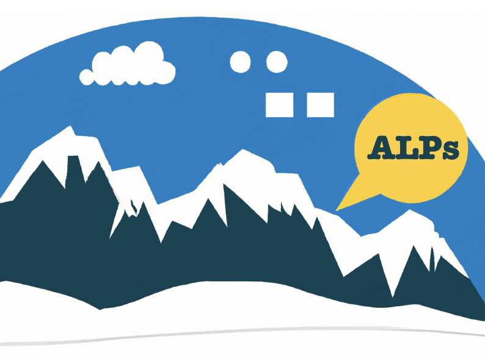
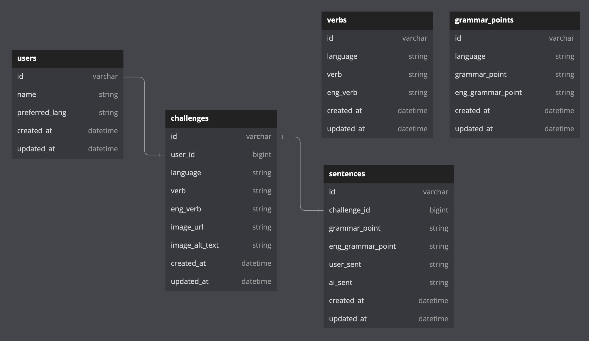
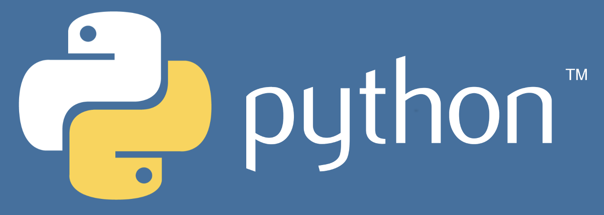
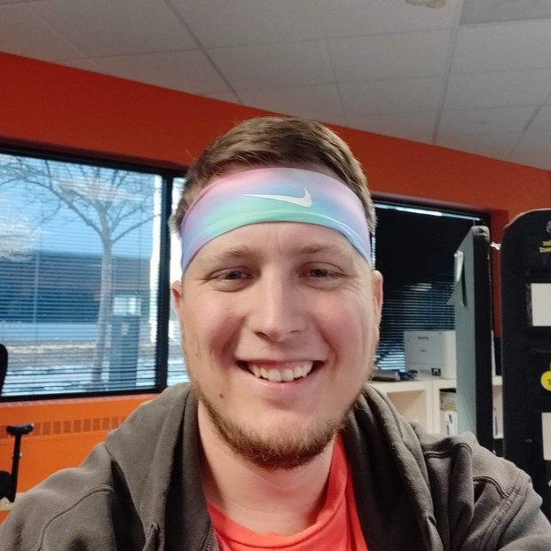

<!-- ReadMe -->

<!-- Opening -->
 

  
 
<!-- <h2 align="center"></h2> -->
  <h2 align="center">Advanced Language Practices (ALPs)</h2>
    

      Improve your language skills with inspiring images & immediate feedback!
      
 
      Now that you've "climbed the mountain" of learning another language, keep your skills fresh with regular practice! Language output (speaking & writing) is key but can get dull with routine drills, plus you may never know if it's entirely correct.  🔸  With ALPs, every writing challenge comes with an inspiring image to ignite your imagination, a random verb & grammar points to help focus your language, and immediate feedback with the help of AI!
    
 

<!-- TABLE OF CONTENTS -->
### Table of Contents

  <ol>
    <li>
      <a href="#about-the-project">About The Project</a>
      <ul>
        <li><a href="#agile-methodology">Agile Methodology</a></li>
        <li><a href="#built-with">Built With</a></li>
      </ul>
    </li>
    <li>
      <a href="#getting-started">Getting Started</a>
      <ul>
        <li><a href="#prerequisites">Prerequisites</a></li>
            <li><a href="#external-api-keys">External API Keys</a></li>
        <li><a href="#schema">Schema</a></li>
        <li><a href="#testing">Testing</a></li>
      </ul>
    </li>
    <li><a href="#endpoints">Endpoints</a></li>
    <li><a href="#apis">External APIs</a></li>
    <li><a href="#technologies">Stretch Technologies</a></li>
    <li><a href="#refactor">Future Iterations</a></li>
    <li><a href="#contact">Contributors</a></li>
  </ol>
 

<!-- ABOUT THE PROJECT -->
<h2 id="about-the-project">About the Project</h2>

🔸 [Production Website] (add link here)
 
🔸 [Backend Service](https://git.heroku.com/calm-thicket-75558.git)
 
🔸 [Front End Repository](https://github.com/A-L-P-s/alps-ui)
 

[Video Presentation] (EMBED VIDEO HERE)

**ALPs** was created by a cross-functional development team of students from the Turing School of Software and Design as their [capstone project](https://mod4.turing.edu/projects/capstone/).

The mission of **ALPs** is to provide users with writing promts that ignite their imagination and provide immediate feedback on their language output.

Users simply choose their target language via an avatar to start a new challenge. When they begin, they'll see a random verb, inspiring image, and multiple grammar points to create fresh, unique sentences. Once they submit the challenge -- with the help of AI -- immediate feedback and correct sentences are provided so they can review and learn even faster! Users also have the option to email a copy of their work to themselves since tracking personal progress not only expediates growth but also cultivates confidence!

 

<!-- Agile Methodology -->
### Agile Methodology

This method is a flexible and iterative approach to project management that focuses on collaboration, adaptability, and continuous improvement. 

The `agile methodology` was chosen for backend development to expedite the app's launch and progressively abstract functions across multiple phases of development.

 

<!-- Built With -->
### Built With
#### `Phase 1:` Delivered Minimum Viable Product (MVC)
 
 

 

#### `Phase 2:` Refactored Deployment
- Replaced:  With: 

 

#### `Phase 3:` Abstracted Functionality with Additional Stretch Technologies

(<a href="#readme-top">back to top</a>)

<!-- GETTING STARTED -->
## Getting Started

If you'd like to demo this API on your local machine:
1. Ensure you have the prerequisites
2. Sign up for external API Keys
2. Clone this repo: `git clone git@github.com:A-L-P-s/ALPs_api.git`
3. Navigate to the root folder: `cd ALPs_api`
4. Run: `bundle install`
5. Run: `rails db:{create,migrate,seed}`
6. Run: `bundle exec figaro install`
7. In the `app/config/application.yml` file add you API keys:
  - `UNSPLASH_API_KEY: add_api_key_here`
  - `OPENAI_API_KEY: add_api_key_here`
8. Inspect the `/db/schema.rb` and compare to the 'Schema' section below to ensure migration has been done successfully
9. Run: `rails s`
10. Visit http://localhost:3000/

 

<!-- Prerequisites -->
### Prerequisites

- Ruby Version 3.1.1
- Rails Version 7.0.4.x
- Bundler Version 2.4.9

 

<!-- External API keys -->
### External API Keys

Sign up for your individual external API keys:
- [Unsplash Image API](https://unsplash.com/documentation#creating-a-developer-account)
    - Follow instructions provided.
- [OpenAI API](https://platform.openai.com/overview)
    - Once you have signed up, click on your profile at the top left and selecting `View API keys`.
    - Then click `Create new secret key`.

 

<!-- Schema -->
### Schema
#### Phase 1:

#### Phase 2:
[Add second image] (when schema changes to microservices)

 

<!-- Testing -->
### Testing
To test the entire spec suite, run `bundle exec rspec`.
*All tests should be passing.*

Happy path, sad path, and edge case testing were considered and tested. When a request cannot be completed, an error object is returned.

  
See Error Object

    <pre>
    <code>
{
  "errors": [
    {
      "status": "404"
      "title": "Invalid Request",
      "detail": "Couldn't find User with 'id'=<id>"
     }
   ]
}
    </code></pre>

 

<!-- Status Codes -->
### Status Codes

See All

**ALPs** API reutrns the folowing status codes:

| Status Code | Description |
| :--- | :--- |
| 200 | `OK` |
| 201 | `CREATED` |
| 204 | `NO CONTENT` |
| 404 | `NOT FOUND` |
| 418 | `I'M A TEAPOT` |
| 422 | `UNPROCESSABLE CONTENT` |
| 500 | `INTERNAL SERVER ERROR` |

(<a href="#readme-top">back to top</a>)

  
<!-- Endpoints -->
## Endpoints

  
<code>GET "/api/v1/users"</code>

  Response:

  | Code | Description |
  | :--- | :--- |
  | 200 | OK |

  <pre>
    <code>
{
  "data": [{
    "id": "55",
    "type": “user",
    "attributes": {
        "name": "Deniz",
        "preferred_lang": "Turkish",
        "challenges": null (or [])
    }},
    {
    "id": "1",
    "type": “user",
    "attributes": {
        "name": "Alexis",
        "preferred_lang": "Spanish",
        "challenges": null (or [])
      }
  }]
}
  </code></pre> 

  
<code>GET "/api/v1/users/:id"</code>

  Response:
  
  | Code | Description |
  | :--- | :--- |
  | 200 | OK |

  <pre>
    <code>
{
  "data": {
    "id": “55”,
    "type": “user",
    "attributes": {
        "name": "Deniz",
        "preferred_lang": "Turkish",
        "challenges": [
            {
              "challenge_id": "1", 
              "language": "Turkish", 
              "verb": "(i) gitmek",
              "eng_verb": "to go", 
              "image_url": "/random/unplash/image.url",
              "image_alt_text": "Plane flying over the Bosphorous", 
              "created_at": "05-30-2023"
            }, 
            { ...etc...}
        ]
     }  
   }
}
    </code></pre>

  
<code>GET "/api/v1/users/:id/challenges/new"</code>

  Response:
  
  | Code | Description |
  | :--- | :--- |
  | 200 | OK |

  <pre>
    <code>
{
  "data": {
    "id": null,
    "type": “challenge",
    "attributes": {
        "language": "Turkish", 
        "verb": "(i) gitmek"
        "eng_verb": "to go" 
        "image_url": "/random/unplash/image.url"
        "image_alt_text": "Plane flying over the Bosphorous" 
        "created_at": null
        "grammar_points": [
           {
            "grammar_point": "geçmiş zaman"
            "eng_grammar_point": "past simple"
           },
           { ...etc...}
        ]
        "sentences": null
     }  
   }
}
    </code></pre>

  
<code>POST "/api/v1/users/:id/challenges"</code>

  Request Body:
  <pre>
    <code>
{
 "language": "Turkish",
 "verb": "(i) gitmek",
 "eng_verb": "to go",
 "image_url": "/random/unplash/image.url",
 "image_alt_text": "Plane flying over the Bosphorous", 
 "sentences": [
   {
    "grammar_point": "geçmiş zaman",
    "eng_grammar_point": "past tense",
    "user_sent": "Dün havalimana gittik ama arkadaşım uçak gelmedi."
    },
    {
      "grammar_point": "geniş zaman",
      "eng_grammar_point": "future tense",
      "user_sent": "Dün havalimana gittik ama arkadaşım uçak gelmeyecek."
    }
  ]
}
    </code>
  </pre>

  Response:
  
  | Code | Description |
  | :--- | :--- |
  | 201 | CREATED |

  <pre>
    <code>
  {
  "data": {
    "id": “1”,
    "type": “challenge",
    "attributes": {
        "language": "Turkish", 
        "verb": "(i) gitmek",
        "eng_verb": "to go", 
        "image_url": "/random/unplash/image.url",
        "image_alt_text": "Plane flying over the Bosphorous", 
        "created_at": "05-30-2023",
        "grammar_points": null,
        "sentences": [
          {
           "sent_id": "1",
           "grammar_point": "geçmiş zaman",
           "eng_grammar_point": "past tense",
           "user_sent": "Dün havalimana gittik ama arkadaşım uçak gelmedi.",
           "ai_sent": "Dün havalimanına gittik, ancak arkadaşımızın uçağı gelmedi."
           }, 
           { ...etc...}     
         ]
     }  
   }
}
    </code></pre>

  
<code>GET "/api/v1/users/:id/challenges/:challenge_id"</code>

  Response:
  
  | Code | Description |
  | :--- | :--- |
  | 200 | OK |

  <pre>
    <code>
{
  "data": {
    "id": “1”,
    "type": “challenge",
    "attributes": {
        "language": "Turkish", 
        "verb": "(i) gitmek",
        "eng_verb": "to go", 
        "image_url": "/random/unplash/image.url",
        "image_alt_text": "Plane flying over the Bosphorous", 
        "created_at": "05-30-2023",
        "grammar_points": null,
        "sentences": [
          {
           "sent_id": "1",
           "grammar_point": "geçmiş zaman",
           "eng_grammar_point": "past tense",
           "user_sent": "Dün havalimana gittik ama arkadaşım uçak gelmedi.",
           "ai_sent": "Dün havalimanına gittik, ancak arkadaşımızın uçağı gelmedi."
           }, 
           { ...etc...}     
         ]
     }  
   }
}
    </code></pre>

  
<code>DELETE "/api/v1/users/:id/challenges/:challenge_id"</code>

  Response:

  | Code | Description |
  | :--- | :--- |
  | 204 | NO CONTENT |

  </pre>

 

View these endpoints in [Postman] (add link here)

(<a href="#readme-top">back to top</a>)

<!-- External APIs -->
<h2 id="apis">External APIs</h2>

<a href="https://unsplash.com/developers"><strong> Unsplash Image API</strong></a>

- Used to generate the random theme image for every writing challenge.
 

<a href="https://openai.com/product"><strong>  OpenAI API</strong></a>

- Used to correct sentences and provide immediate feedback on user's language output.

(<a href="#readme-top">back to top</a>)

<!-- Stretch Technologies -->
<h2 id="technologies">Stretch Technologies</h2>

<!-- AWS -->
<a href="https://aws.amazon.com/"><strong> Elastic Beanstock Deployment</strong></a>

- Phase 2: Amazon Web Services was used to deploy the application.
 

<!-- Python -->
<a href="https://www.python.org/"><strong> Python Programming Language</strong></a>

- Phase 2: Used as the programming language to build microservices.
 

<!-- Django -->
<a href="https://www.djangoproject.com/"><strong> Django Web Framework</strong></a>

- Phase 2: Used as the web framework to build microservices.
 

<!-- Twilio / Sendgrid -->
<a href="https://sendgrid.com/"><strong> Twilio/Sendgrid Email Service</strong></a>

- Phase 2: Used to allow users to email themselves a copy of their completed challenge.

(<a href="#readme-top">back to top</a>)

<!-- Future Iterations -->
<h2 id="refactor">Future Iterations</h2>

  
See Refactoring Suggestions

  <dl>
    <dt>🔸 Add authorization & authentication</dt>
      <dd>- Allow users to create own profile and dashboard</dd>
    <dt>🔸 Expand AI functionality</dt>
      <dd>- Add questions/quizes created by AI for language topics</dd>
      <dd>- Create and save flashcards</dd>
    <dt>🔸 Create administrative role</dt>
      <dd>- Track statistics of all users and languages</dd>
  </dl>

(<a href="#readme-top">back to top</a>)

<h2 id="contact">Contributors</h2>

 

|  |  |  |  |  | 
| ------------------ | ------------ | -------------- | ----------- | -------------- | 
| Kirk Hauck | Bea Ordonez | Katherine Blaine | Tyalor Pridgen | Brian Zanti | 
| FrontEnd | FrontEnd | FrontEnd | Project Mentor | Project Manager |
| [GitHub](https://github.com/kirkhauck) | [GitHub](https://github.com/bea-ordonez) | [GitHub](https://github.com/KatherineBlaine) | [GitHub](https://github.com/pridgey) | [GitHub](https://github.com/BrianZanti) |
| [LinkedIn](https://www.linkedin.com/in/kirk-hauck/) |  [LinkedIn](https://www.linkedin.com/in/bea-ordonez/) | [LinkedIn](https://www.linkedin.com/in/katherinekblaine/) | [LinkedIn](https://www.linkedin.com/in/taylor-pridgen-a3aa7918/) | [LinkedIn](https://www.linkedin.com/in/brianzanti/) |

 

|  |  |  |  |  |
| ------------------ | ------------ | -------------- | ----------- | -------------- | 
| Caleb Thomas | James Taylor | Huy Phan | David Marino | Melony Erin Franchini |
| BackEnd | BackEnd | BackEnd | BackEnd | BackEnd | 
| [GitHub](https://github.com/cjthomas00) | [GitHub](https://github.com/JTaylor28) | [GitHub](https://github.com/HuyPhan2025) | [GitHub](https://github.com/davejm8) | [GitHub](https://github.com/MelTravelz) |
| [LinkedIn](https://www.linkedin.com/in/calebjthomas/) |  [LinkedIn](https://www.linkedin.com/in/james-taylor-a02a7a199/) | [LinkedIn](https://www.linkedin.com/in/huy-phan-2471b3261/) | [LinkedIn](https://www.linkedin.com/in/davidjmarino8/) | [LinkedIn](https://www.linkedin.com/in/melony-erin-franchini/) |

(<a href="#readme-top">back to top</a>)

